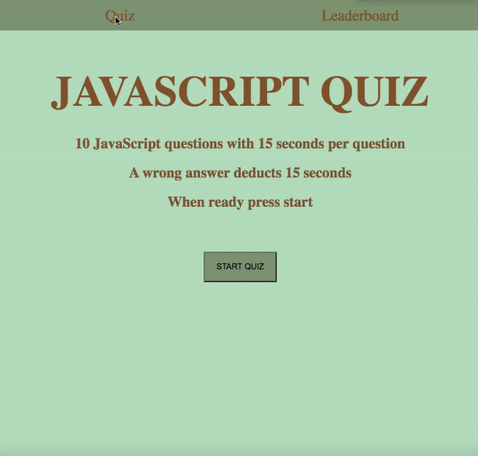
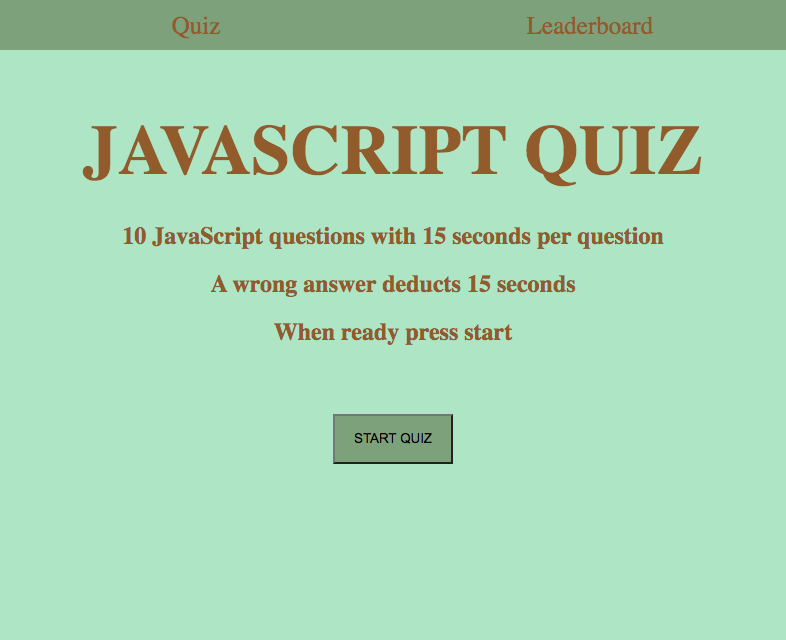

# Javascript Quiz

This quiz randomly selects the order of 10 questions. Every correct answer gets one point and your score can be saved to the leaderboard using local storage. Working on this assignment thoroghly taught me how to create a dynamic application with Javascript that takes input through clicks.

## HW repository

https://github.com/saharVac/javascript-quiz

## Deployed version of the app

https://saharvac.github.io/javascript-quiz

## Running the application

Page is easily navigable, refer to the following gif and screenshots:

## Website used

I obtained my question from the following page:
https://www.tutorialspoint.com/javascript/javascript_online_quiz.htm
